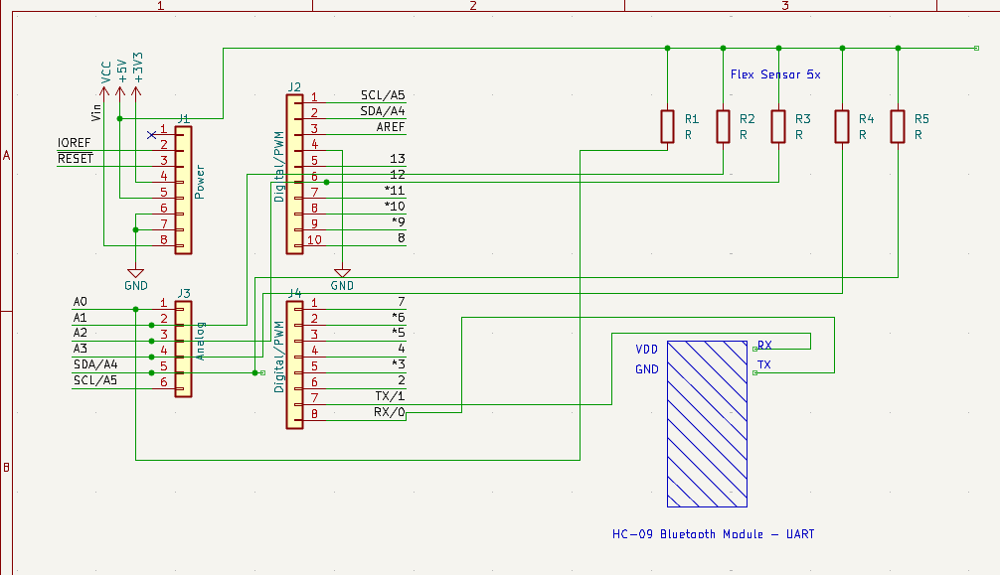
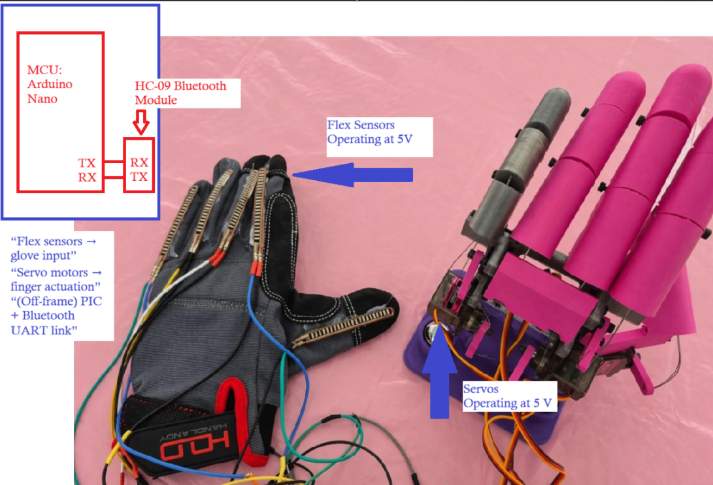
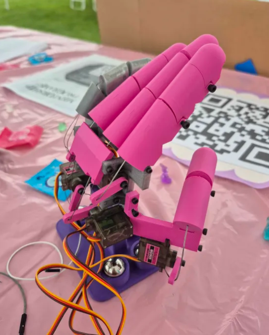
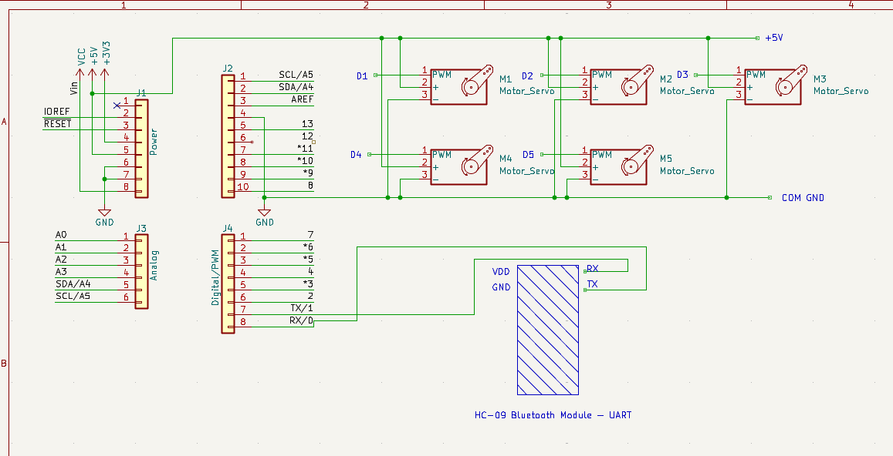

# 🦾 Bluetooth Robotic Hand

An embedded systems project using **two Arduino Uno (ATmega328P) microcontrollers** to wirelessly translate human finger movements into real-time robotic hand motion.

Five flex sensors mounted on a wearable glove measure individual finger positions. The first Arduino Uno acquires and processes the sensor measurements, then transmits the control data over Bluetooth to a second Arduino Uno. The receiving microcontroller converts the transmitted finger positions into servo commands that control the robotic hand.

---

## Table of Contents

- [Project Overview](#project-overview)
- [Hardware Demo](#hardware-demo)
- [System Architecture](#system-architecture)
- [Hardware](#hardware)
- [Firmware](#firmware)
- [Sensor Processing](#sensor-processing)
- [Wireless Communication](#wireless-communication)
- [Embedded Systems Concepts](#embedded-systems-concepts)
- [Project Images](#project-images)
- [Future Improvements](#future-improvements)

---

## Project Overview

The goal of this project was to develop a wireless embedded system capable of translating human finger movements into corresponding movements on a robotic hand.

The system is divided into two embedded nodes:

**Glove Controller**  
An Arduino Uno reads five flex sensors through its analog inputs. The sensor measurements are processed and converted into finger-position data before being transmitted wirelessly.

**Robotic Hand Controller**  
A second Arduino Uno receives the transmitted data and controls five servo motors corresponding to the thumb, index, middle, ring, and pinky fingers.

This project involved sensor acquisition, microcontroller programming, wireless communication, actuator control, calibration, circuit prototyping, and hardware-software integration.

---

## Hardware Demo

The prototype demonstrates flex sensor measurements from the wearable glove being translated into physical movement of the robotic hand.

<!-- Drag Robotic_Hand_Prototyping.mov here using the GitHub README editor -->

---

## System Architecture

```text
        WEARABLE GLOVE
             
       Five Flex Sensors
           A0 - A4
              │
              │ Analog
              ▼
     ┌───────────────────┐
     │   Arduino Uno #1  │
     │    ATmega328P     │
     │                   │
     │  ADC Acquisition  │
     │        ↓          │
     │ Sensor Processing │
     │        ↓          │
     │ Data Transmission │
     └─────────┬─────────┘
               │
               │ Bluetooth
               ▼
     ┌───────────────────┐
     │   Arduino Uno #2  │
     │    ATmega328P     │
     │                   │
     │  Receive Commands │
     │        ↓          │
     │   Servo Control   │
     └─────────┬─────────┘
               │
               │ PWM
               ▼
        Five Servo Motors
               │
               ▼
          Robotic Hand
```

---

## Hardware

| Component | Quantity | Purpose |
|---|---:|---|
| Arduino Uno (ATmega328P) | 2 | Glove and robotic hand controllers |
| Flex Sensors | 5 | Measure individual finger movement |
| Servo Motors | 5 | Control robotic finger positions |
| Bluetooth Modules | 2 | Wireless communication between controllers |
| Sensor Glove | 1 | Wearable sensor interface |
| Robotic Hand | 1 | Mechanical output system |
| Prototype Circuitry | — | Sensor, communication, and actuator connections |

### Glove Controller

The first Arduino Uno interfaces with the five flex sensors:

| Finger | Analog Input |
|---|---|
| Thumb | A0 |
| Index | A1 |
| Middle | A2 |
| Ring | A3 |
| Pinky | A4 |

### Robotic Hand Controller

The second Arduino Uno controls the five servo motors:

| Finger | Servo Pin |
|---|---|
| Thumb | D2 |
| Index | D3 |
| Pinky | D4 |
| Middle | D5 |
| Ring | D6 |

---

## Firmware

The original system firmware was developed using **Arduino C++** for the ATmega328P-based Arduino Uno.

Because the project uses two microcontrollers, the firmware can be separated into two primary components:

```text
firmware/
│
├── glove_controller/
│   └── glove_controller.ino
│
└── hand_controller/
    └── hand_controller.ino
```

### Glove Controller

The glove-side firmware is responsible for:

1. Reading the five flex sensors.
2. Filtering the analog measurements.
3. Applying sensor calibration.
4. Converting measurements into finger-position data.
5. Transmitting the resulting data over Bluetooth.

### Robotic Hand Controller

The hand-side firmware is responsible for:

1. Receiving finger-position data over Bluetooth.
2. Parsing the received commands.
3. Mapping the received values to servo positions.
4. Updating the five servo motors.

---

## Sensor Processing

The glove controller processes each flex sensor independently.

```text
Finger Movement
      │
      ▼
 Flex Sensor
      │
      ▼
ADC Measurement
      │
      ▼
Sensor Filtering
      │
      ▼
Calibration
      │
      ▼
Finger Position
      │
      ▼
Bluetooth Transmission
```

Calibration allows the system to associate raw flex-sensor measurements with the physical extended and closed positions of each finger.

---

## Wireless Communication

Bluetooth provides the communication link between the two Arduino Uno controllers.

```text
Glove Uno                     Hand Uno
ATmega328P                   ATmega328P
    │                            ▲
    ▼                            │
Bluetooth  ─ ─ ─ Wireless ─ ─ Bluetooth
   TX                              RX
```

This separates sensor acquisition from robotic hand actuation and allows the glove to control the hand without a physical connection between the two embedded systems.

---

## Embedded Systems Concepts

This project demonstrates experience with:

- Embedded C/C++
- Arduino Uno / ATmega328P
- Multi-microcontroller system integration
- Analog-to-Digital Conversion (ADC)
- Analog sensor acquisition
- Sensor calibration
- Signal filtering
- Serial communication
- Bluetooth communication
- PWM servo control
- Real-time sensor processing
- Hardware-software integration
- Circuit prototyping
- Embedded debugging

---

## Project Images

### Sensor Glove



Wearable glove containing five flex sensors and the glove-side embedded controller.

### Robotic Hand



Servo-controlled robotic hand driven by the second Arduino Uno.

### Hardware Close-Up



Prototype hardware used during development and integration of the robotic hand.

### Circuit Schematic



Electrical schematic for the robotic hand system.

---

## Future Improvements

- Individual calibration profiles for each flex sensor
- Improved digital filtering
- Closed-loop finger position feedback
- More robust wireless packet handling
- Custom PCB integration
- Additional sensors for hand orientation
- Register-level ATmega328P firmware
- Non-blocking sensor acquisition and communication
