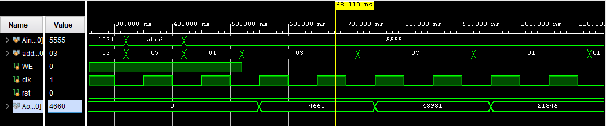
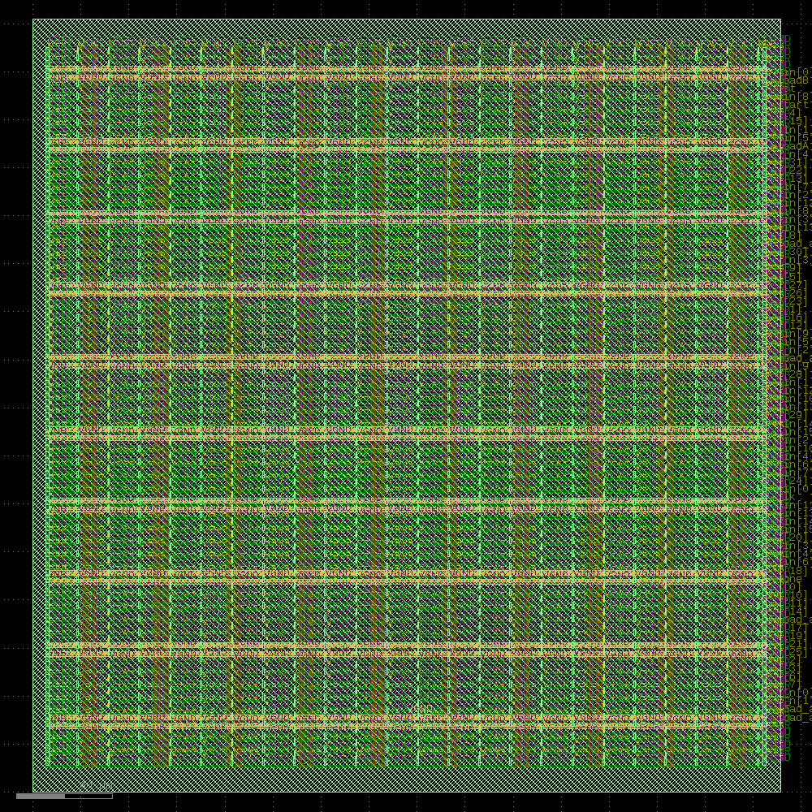
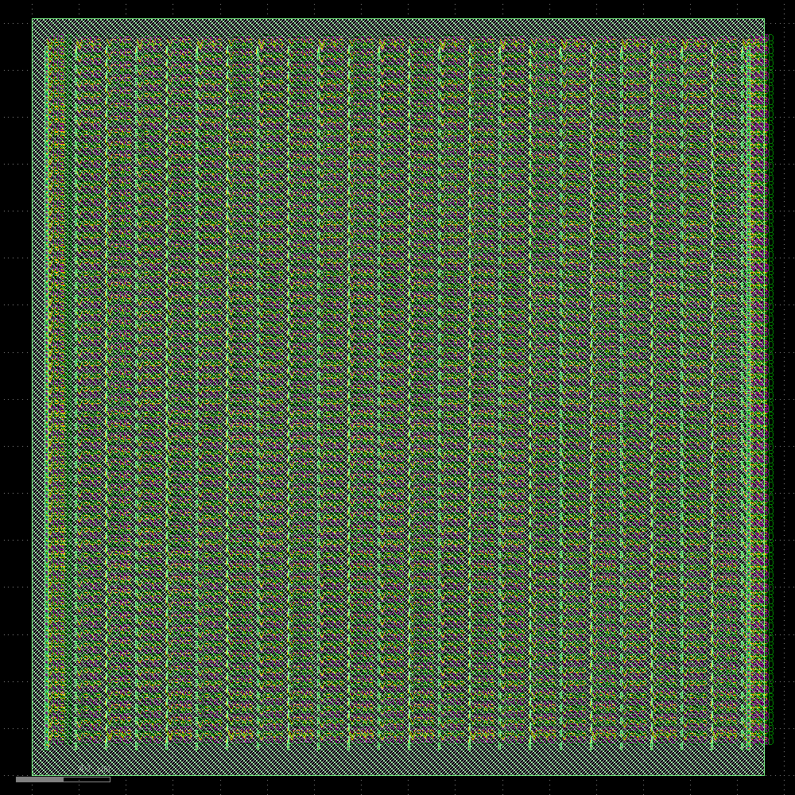
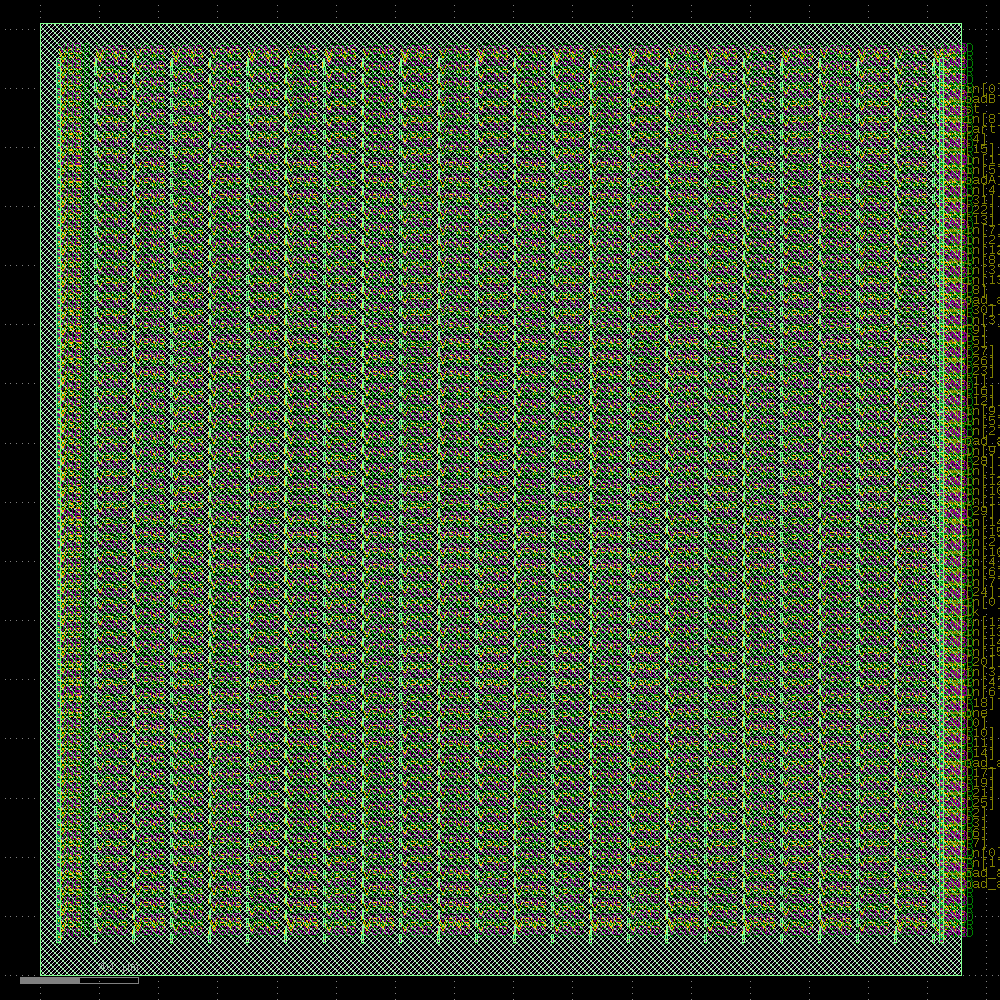
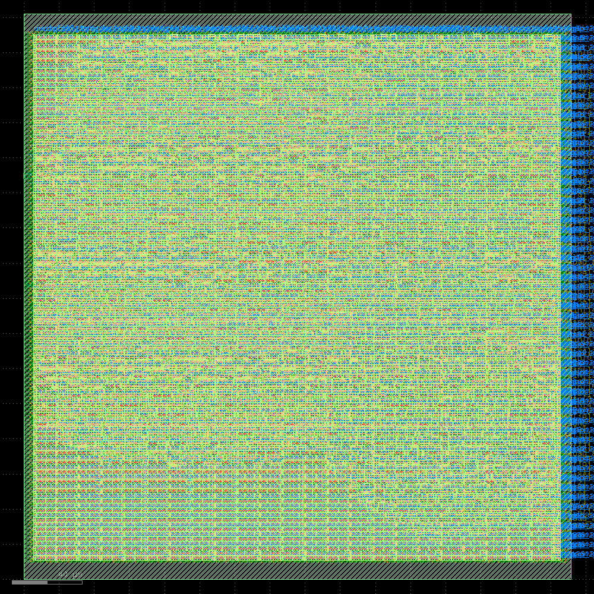

# ⚡ Digital Convolution Processing System — FPGA & ASIC Design

A modular digital convolution-style processing system designed in **Verilog HDL** and verified through simulation and MATLAB.

The project demonstrates **RTL design, memory interfacing, sequential control logic, signed arithmetic datapaths, functional verification, and ASIC physical design**. The verified RTL was taken through the **OpenLane RTL-to-GDS flow**, including synthesis, floorplanning, power distribution, placement, clock tree synthesis, routing, and final layout generation.

---

## Table of Contents

- [Project Overview](#project-overview)
- [System Architecture](#system-architecture)
- [RTL Modules](#rtl-modules)
- [Verilog Implementation](#verilog-implementation)
- [Functional Verification](#functional-verification)
- [Convolution Verification](#convolution-verification)
- [MATLAB Verification](#matlab-verification)
- [ASIC Physical Design](#asic-physical-design)
- [Skills Demonstrated](#skills-demonstrated)
- [Future Improvements](#future-improvements)

---

## Project Overview

The goal of this project was to design and implement a modular digital processing architecture capable of performing convolution-style arithmetic operations in hardware.

The system uses separate memory modules to store **16-bit input data and coefficient values**. A control unit sequentially accesses memory locations and supplies the data to a signed multiplier.

The resulting arithmetic data can then be processed by additional datapath modules for output selection and future accumulation operations.

The design was developed using **Verilog HDL** and functionally verified using Verilog testbenches and waveform analysis.

A MATLAB convolution implementation was also used as an independent reference to compare the hardware-generated results.

Finally, the RTL design was taken through the **OpenLane ASIC physical design flow** to generate a final physical layout.

---

## System Architecture

```text
                 ┌──────────────┐
                 │   Memory A   │
                 │  Input Data  │
                 │  32 × 16-bit │
                 └──────┬───────┘
                        │
                        │ A
                        ▼
                 ┌──────────────┐
                 │  Multiplier  │◄──────────── Memory B
                 │   16 × 16    │              Coefficients
                 └──────┬───────┘
                        │
                        │ 32-bit Product
                        ▼
                 ┌──────────────┐
                 │     RCA2     │
                 │    Adder     │
                 └──────┬───────┘
                        │
                        ▼
                 ┌──────────────┐
                 │     MUX      │
                 │ Output Logic │
                 └──────┬───────┘
                        │
                        ▼
                      Output


                 ┌──────────────┐
                 │   Memory C   │
                 │ 32-bit Data  │
                 │   Storage    │
                 └──────────────┘


        ┌──────────────────────────────┐
        │          Top Module          │
        │                              │
        │ Address Generation           │
        │ Memory Control               │
        │ Sequential Processing        │
        │ Output Synchronization       │
        └──────────────────────────────┘
```

---

# RTL Modules

The design is divided into independent RTL modules to improve readability, verification, debugging, and scalability.

---

## Memory A

`MemoryA` stores the primary input sequence used by the processing system.

The module contains **32 memory locations**, with each location storing a **16-bit value**.

```text
Memory Depth : 32
Data Width   : 16 bits
Address Width: 5 bits
```

The module supports synchronous read and write operations controlled by the clock and write-enable signals.

During reset, the memory locations are initialized to zero to provide predictable startup behavior.

### Memory A Verification

The Memory A module was independently simulated to verify correct memory access and data behavior.



---

## Memory B

`MemoryB` stores the secondary input values or coefficient data used during multiplication.

Like Memory A, the module contains:

```text
32 × 16-bit memory
```

A **5-bit address** selects one of the 32 memory locations.

Stored values are provided through the `Bout` output signal during read operations.

### Memory B Verification

The `MemoryB_tb` testbench verifies that values can be correctly written to and retrieved from different memory addresses.

The simulation checks:

- Address selection
- Write operations
- Read operations
- Clock synchronization
- Data integrity


---

## Memory C

`MemoryC` provides storage for larger arithmetic results.

Unlike Memory A and Memory B, Memory C uses a **32-bit data width** to accommodate results generated by arithmetic operations.

```text
Memory Depth : 32
Data Width   : 32 bits
Address Width: 5 bits
```

The module supports synchronous memory operations and asynchronous reset behavior.

Memory C also provides a path for future expansion of the architecture to store accumulated convolution outputs or intermediate processing values.

---

## Multiplier

The `Multiplier` module is the primary arithmetic unit within the datapath.

It performs **signed 16-bit multiplication** between values provided by Memory A and Memory B.

```text
        A[15:0]
           │
           ▼
      ┌──────────┐
      │          │
      │ Signed   │
      │ 16 × 16  │
      │ Multiply │
      │          │
      └────┬─────┘
           │
           ▼
     Product[31:0]
```

The operation is:

```text
Product = A × B
```

Because two signed 16-bit values are multiplied, the result is represented using a **32-bit signed output**.

---

## RCA2 Adder

The `RCA2` module provides an arithmetic addition stage.

It adds the current multiplication product to a previous input value to generate a new output.

```text
Previous Value ─────┐
                    ▼
                 ┌─────┐
Product ─────────►  +  ├────► Result
                 └─────┘
```

This module provides the arithmetic foundation for future multiply-accumulate (MAC) operations in a more complete convolution architecture.

---

## MUX

The `MUX` module controls whether valid data is allowed to propagate to the output.

When the `valid` signal is asserted:

```text
valid = 1

Input ─────────────► Bi
```

When `valid` is inactive:

```text
valid = 0

Bi = 0
```

This prevents invalid intermediate data from appearing as valid output.

---

## CompareB

The `CompareB` module performs sequential comparison operations using an internal counter.

The module repeatedly compares the input against an incrementing value and generates a processed output.

Once the comparison sequence has completed, the module asserts:

```verilog
done
```

to indicate completion.

---

## Top Module

The **Top Module** coordinates the operation of the complete system.

Its responsibilities include:

- Memory addressing
- Memory read control
- Sequential address generation
- Arithmetic operation coordination
- Multiplier synchronization
- Output generation
- Computation control

Internal control signals such as:

```verilog
computing
wait_read
```

are used to coordinate memory accesses and arithmetic operations across multiple clock cycles.

The controller ensures that memory data is available before arithmetic operations are performed.

---

# Verilog Implementation

Each subsystem was implemented as an independent Verilog module.

The modular architecture separates:

```text
Memory
   │
Control
   │
Arithmetic
   │
Output Logic
```

Memory modules use register arrays indexed by **5-bit address signals**.

Sequential logic is implemented using positive-edge-triggered blocks:

```verilog
always @(posedge clk)
```

while arithmetic datapath operations are implemented using combinational logic.

This modular structure allows individual components to be independently simulated and verified before integration into the Top Module.

---

# Functional Verification

Functional verification was performed using **Verilog testbenches and waveform simulation**.

The verification process tested both individual RTL modules and the integrated processing system.

## Testbench Flow

```text
Initialize Design
       │
       ▼
Load Memory A
       │
       ▼
Load Memory B
       │
       ▼
Assert Start
       │
       ▼
Sequential Memory Access
       │
       ▼
Arithmetic Processing
       │
       ▼
Generate Valid Outputs
       │
       ▼
Compare Results
```

The `TopModule_tb` testbench loads values into Memory A and Memory B before initiating computation using the `start` signal.

Waveform analysis was used to verify synchronization between:

- Clock signals
- Memory addresses
- Memory outputs
- Control signals
- Arithmetic operations
- Output generation

### System Simulation

The following simulation demonstrates the processing system operating with **16 input values and two impulse inputs**.


---

# Convolution Verification

The system was also tested using the following input sequence:

```text
x[n] =
[1, 2, 3, 4, 5, 6, 7, 8,
 9, 10, 11, 12, 13, 14, 15, 16,
 17, 18, 19, 20, 21, 22, 23, 24,
 25, 26, 27, 28, 29, 30, 31, 32]
```

with:

```text
h[n] = [2]
```

For this test case, each input sample is multiplied by the coefficient `2`.

The expected result is:

```text
y[n] =
[2, 4, 6, 8, 10, 12, 14, 16,
 18, 20, 22, 24, 26, 28, 30, 32,
 34, 36, 38, 40, 42, 44, 46, 48,
 50, 52, 54, 56, 58, 60, 62, 64]
```

### Final HDL Results

The final HDL simulation output demonstrates the resulting data generated by the processing architecture.


---

# MATLAB Verification

A MATLAB implementation was used as an independent reference for validating the HDL simulation.

The same input sequences used by the Verilog testbench were processed using MATLAB's convolution operation.

```matlab
x = 1:32;
h = [2];

y = conv(x, h);
```

The MATLAB results were compared against the corresponding outputs produced by the HDL simulation.

### MATLAB Results


The corresponding results matched for the tested input sequence, providing an independent verification of the implemented arithmetic behavior.

---

# ASIC Physical Design

After functional RTL verification, the design was processed through the **OpenLane RTL-to-GDS ASIC design flow**.

The physical implementation included several stages required to transform the RTL design into a physical integrated-circuit layout.

```text
              Verilog RTL
                   │
                   ▼
               Synthesis
                   │
                   ▼
              Floorplanning
                   │
                   ▼
              I/O Placement
                   │
                   ▼
          Tap / Endcap Insertion
                   │
                   ▼
            PDN Generation
                   │
                   ▼
            Global Placement
                   │
                   ▼
           Detailed Placement
                   │
                   ▼
         Clock Tree Synthesis
                   │
                   ▼
            Detailed Routing
                   │
                   ▼
           Final ASIC Layout
                   │
                   ▼
                  GDS
```

---

## Synthesis

The Verilog RTL was synthesized into a gate-level representation of the digital design.

Synthesis translates the behavioral and RTL-level hardware description into standard-cell logic that can be used during physical implementation.

---

## Floorplanning

Floorplanning establishes the physical dimensions and initial organization of the ASIC design.

This stage prepares the design for placement, power distribution, and routing.

---

## I/O Placement

During I/O placement, the design's interface pins were positioned around the physical design boundary.



---

## Tap and Endcap Cell Insertion

Tap and endcap cells were inserted as part of the physical implementation flow.

These physical-only cells support proper standard-cell row implementation and physical design requirements.



---

## Power Distribution Network

A **Power Distribution Network (PDN)** was generated to distribute power throughout the physical design.

The PDN provides the power infrastructure required by the standard cells within the ASIC.



---

## Global Placement

Global placement determines approximate locations for the standard cells while considering design connectivity and available physical area.


---

## Detailed Placement

Detailed placement refines the locations generated during global placement and aligns standard cells to legal placement sites.


---

## Clock Tree Synthesis

**Clock Tree Synthesis (CTS)** generates the physical clock distribution network used to deliver the clock signal to sequential elements throughout the design.


---

## Detailed Routing

Detailed routing generates the physical metal interconnections required to connect the placed standard cells.


---

## Final ASIC Layout

After placement, clock-tree generation, and routing, the OpenLane flow produced the final physical layout of the digital processing system.



The final layout represents the physical implementation generated from the original Verilog RTL through the OpenLane RTL-to-GDS flow.

---

# Skills Demonstrated

This project demonstrates experience with:

### RTL & Digital Design

- Verilog HDL
- RTL design
- Modular hardware architecture
- Sequential logic
- Combinational logic
- Memory interfacing
- Signed binary arithmetic
- Hardware multiplication
- Arithmetic datapaths
- Control logic

### Verification

- Verilog testbench development
- Waveform analysis
- Module-level verification
- System-level functional verification
- MATLAB reference-model verification

### ASIC Physical Design

- OpenLane RTL-to-GDS flow
- RTL synthesis
- Floorplanning
- I/O placement
- Tap/endcap cell insertion
- Power Distribution Network generation
- Global placement
- Detailed placement
- Clock Tree Synthesis
- Detailed routing
- Physical layout generation
- GDS generation

---

# Future Improvements

Potential extensions to the architecture include:

- Multi-tap convolution kernels
- Complete multiply-accumulate (MAC) processing
- Pipelined arithmetic stages
- Parallel multiplier architectures
- Increased processing throughput
- Parameterized memory depth and data width
- Additional verification test vectors
- Automated RTL/MATLAB result comparison
- FPGA resource and timing optimization
- ASIC timing, power, and area optimization
