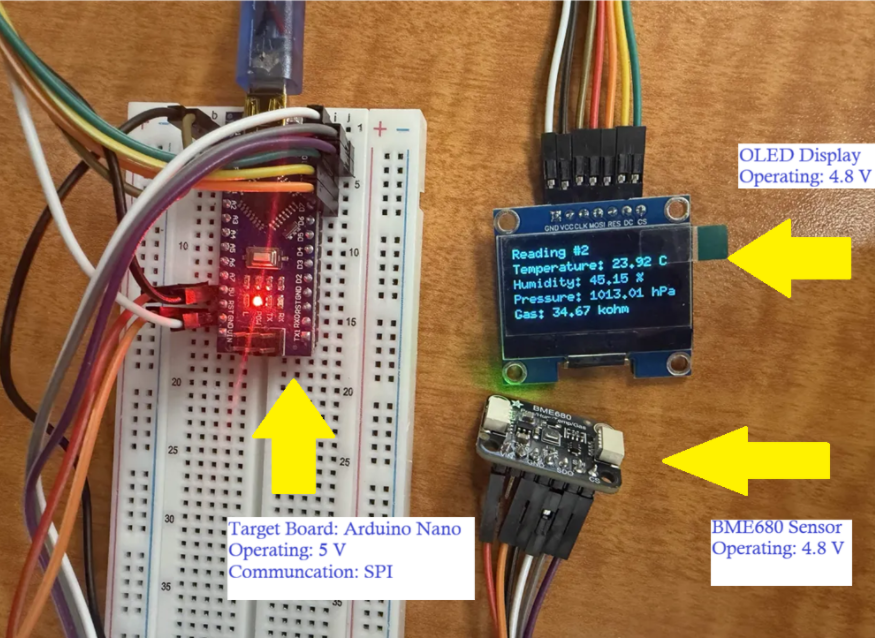
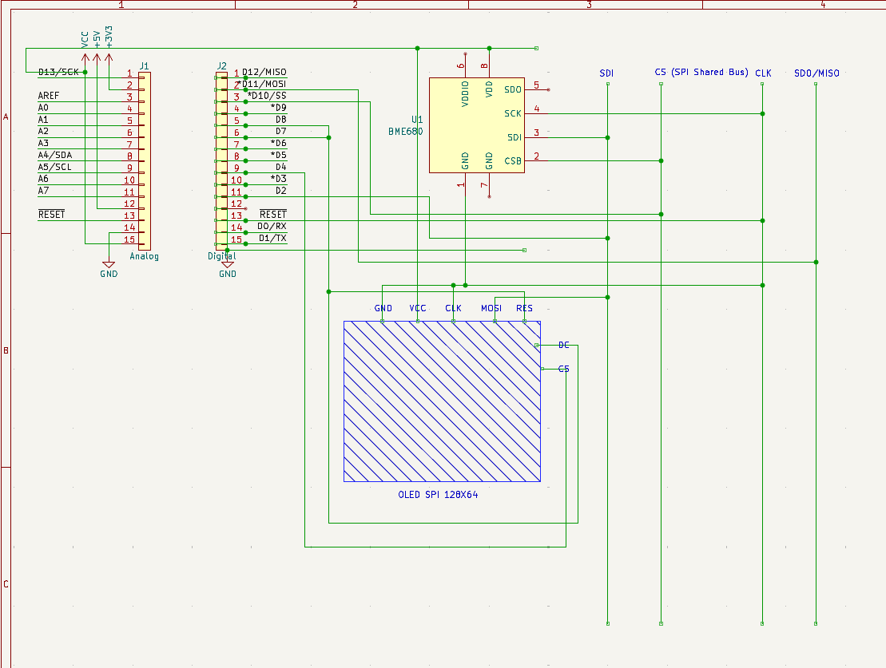

# 🌱 Environmental Monitoring & Data Acquisition System

An embedded environmental monitoring system that acquires and processes sensor data from a **BME680 environmental sensor** and displays the measurements on a **128×64 OLED display**.

The system measures **temperature, humidity, atmospheric pressure, and gas resistance** while demonstrating sensor integration, SPI communication, data acquisition, filtering, and embedded display control.

---

## Table of Contents

- [Project Overview](#project-overview)
- [System Architecture](#system-architecture)
- [Hardware](#hardware)
- [Communication](#communication)
- [Firmware](#firmware)
- [Sensor Data Acquisition](#sensor-data-acquisition)
- [Data Processing](#data-processing)
- [OLED Display](#oled-display)
- [Project Images](#project-images)
- [Embedded Systems Concepts](#embedded-systems-concepts)
- [Future Improvements](#future-improvements)

---

## Project Overview

The goal of this project was to develop an embedded data-acquisition system capable of collecting multiple environmental measurements and presenting them locally to the user.

A **BME680 environmental sensor** is used to measure:

- Temperature
- Relative humidity
- Atmospheric pressure
- Gas resistance

The microcontroller communicates with both the BME680 sensor and OLED display using **SPI**.

Sensor measurements are collected into arrays before being displayed on the OLED. Serial output is also used for debugging and monitoring sensor measurements during development.

---

## System Architecture

```text
          Environmental Conditions
                   │
                   ▼
          ┌─────────────────┐
          │     BME680      │
          │                 │
          │  Temperature    │
          │  Humidity       │
          │  Pressure       │
          │  Gas Resistance │
          └────────┬────────┘
                   │
                   │ SPI
                   ▼
          ┌─────────────────┐
          │ Microcontroller │
          │                 │
          │ Sensor          │
          │ Acquisition     │
          │       ↓         │
          │ Data Storage    │
          │       ↓         │
          │ Processing      │
          └───────┬─────────┘
                  │
            ┌─────┴─────┐
            │           │
            ▼           ▼
       Serial UART   SPI Display
            │           │
            ▼           ▼
       Debug Output  SH1106 OLED
```

---

## Hardware

| Component | Purpose |
|---|---|
| BME680 | Environmental sensor |
| SH1106 128×64 OLED | Displays sensor measurements |
| Microcontroller | Sensor acquisition and data processing |
| Prototype Circuit | Sensor and display integration |

### SPI Chip Select Pins

The sensor and OLED share the SPI interface while using separate chip-select signals.

| Device | Pin |
|---|---|
| BME680 CS | D10 |
| OLED CS | D9 |
| OLED DC | D8 |
| OLED Reset | D7 |

---

## Communication

The BME680 and OLED communicate with the microcontroller using the **SPI protocol**.

Separate chip-select signals allow the microcontroller to determine which peripheral is active on the shared SPI bus.

```text
                    SPI Bus
                       │
           ┌───────────┴───────────┐
           │                       │
           ▼                       ▼
       BME680                   OLED
       CS = D10                 CS = D9
```

The firmware controls the chip-select lines before communicating with each peripheral.

Serial communication at **9600 baud** is also used to print sensor measurements for debugging.

---

## Firmware

The firmware is written in **C++ using the Arduino framework**.

Libraries used include:

```cpp
#include <SPI.h>
#include <U8g2lib.h>
#include <Adafruit_Sensor.h>
#include <Adafruit_BME680.h>
```

The firmware performs four main operations:

1. Initialize the BME680 and OLED.
2. Acquire environmental sensor measurements.
3. Store a series of sensor readings.
4. Display the recorded measurements on the OLED.

---

## Sensor Data Acquisition

The firmware collects **10 environmental measurements** during each acquisition cycle.

```cpp
const int numReadings = 10;
```

Separate arrays store each sensor measurement:

```cpp
float tempReading[numReadings];
float gasReading[numReadings];
float pressureReading[numReadings];
float humidityReading[numReadings];
```

For each acquisition, the BME680 provides:

```text
Temperature      → °C
Humidity         → %
Pressure         → hPa
Gas Resistance   → kΩ
```

---

## Data Processing

The BME680 is configured with oversampling and filtering to improve measurement stability.

### Temperature

```cpp
bme.setTemperatureOversampling(BME680_OS_2X);
```

### Humidity

```cpp
bme.setHumidityOversampling(BME680_OS_2X);
```

### Pressure

```cpp
bme.setPressureOversampling(BME680_OS_4X);
```

### IIR Filtering

```cpp
bme.setIIRFilterSize(BME680_FILTER_SIZE_3);
```

Pressure and gas-resistance measurements are also converted into more readable engineering units before being stored.

```text
Pressure:
Pa → hPa

Gas Resistance:
Ω → kΩ
```

---

## OLED Display

After the sensor measurements are collected, the firmware displays each stored reading on the **128×64 SH1106 OLED**.

Each display page contains:

```text
Reading #0

Temperature: XX.XX C
Humidity:    XX.XX %
Pressure:    XXXX.XX hPa
Gas:         XX.XX kohm
```

The display cycles through the stored measurements so the user can view the collected environmental data.

---

## Project Images

### Environmental Sensor



BME680 environmental sensor used for temperature, humidity, pressure, and gas-resistance measurements.

### Circuit Schematic



Circuit schematic showing the sensor and display integration used by the environmental monitoring system.

---

## Embedded Systems Concepts

This project demonstrates experience with:

- Embedded C++
- Environmental sensor integration
- SPI communication
- Shared peripheral buses
- Chip-select control
- Analog and digital sensor data acquisition
- Sensor configuration
- Oversampling
- Digital filtering
- UART / serial debugging
- OLED display integration
- Embedded data storage
- Hardware-software integration
- Circuit prototyping
- Embedded debugging

---

## Future Improvements

Potential improvements include:

- FreeRTOS task-based architecture
- Separate sensor acquisition and display tasks
- RTOS queues for transferring sensor data
- Periodic task scheduling
- Non-blocking sensor acquisition
- Additional environmental sensors
- Wireless telemetry
- Data logging
- Alarm thresholds
- Long-term environmental trend monitoring
